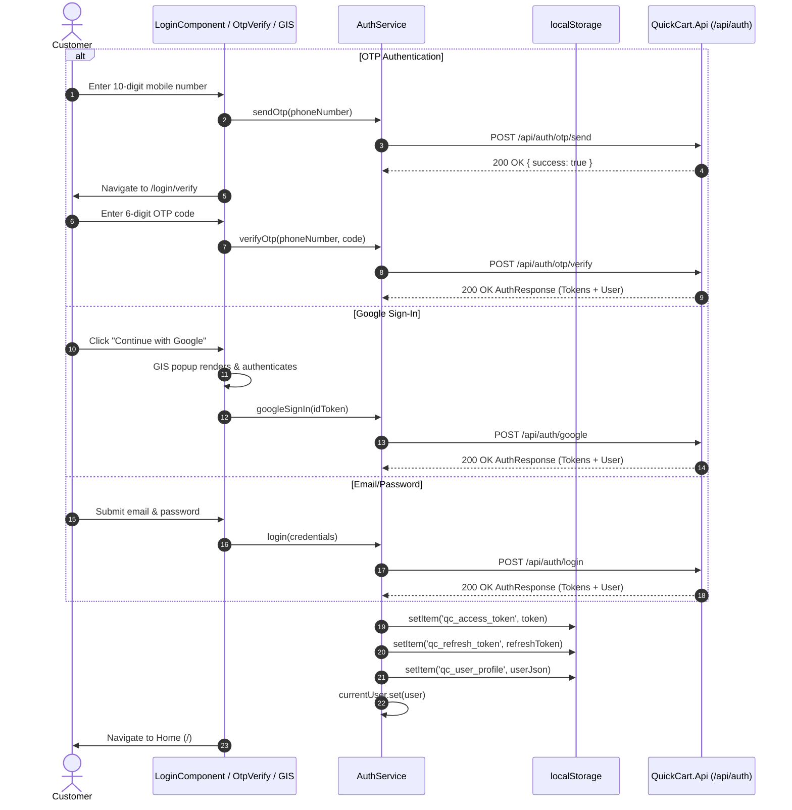
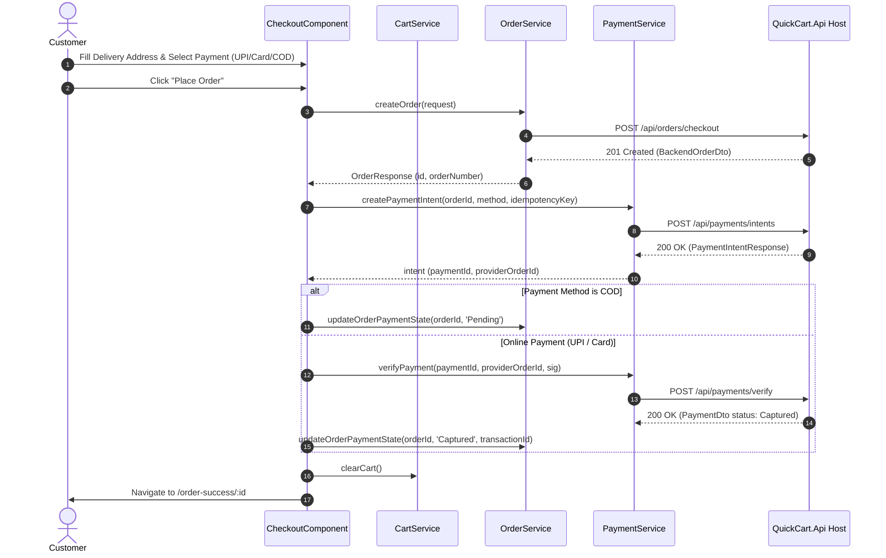
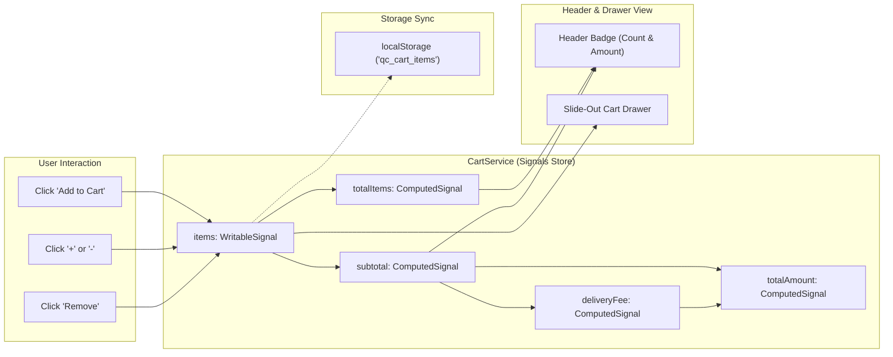
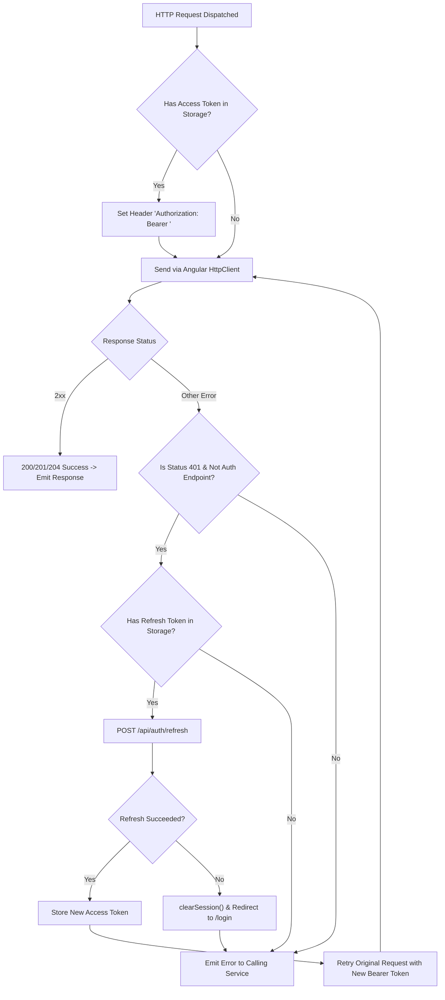

# QuickCart Frontend — Architecture Diagrams

This document contains visual Mermaid architectural diagrams modeling the runtime flows, layout hierarchy, state management, and authentication mechanics of the QuickCart frontend application.

---

## 1. Application Layout & Component Hierarchy

```mermaid
flowchart TD
    AppRoot["App Root Shell (src/app/app.ts)"]
    RouterOutlet["Root Router Outlet (<router-outlet />)"]
    
    subgraph CommerceLayout["MainLayoutComponent (/)]
        Header["HeaderComponent (Logo, Delivery Badge, Search, ThemeToggle, UserMenu, CartTrigger)"]
        ChildOutlet["Child Router Outlet"]
        CartDrawer["CartDrawerComponent (Slide-Out Drawer)"]
        Footer["FooterComponent (Guarantees, Links)"]
        
        ProductList["ProductListComponent (Home /)"]
        Checkout["CheckoutComponent (/checkout)"]
        OrderSuccess["OrderSuccessComponent (/order-success/:id)"]
    end
    
    subgraph AuthViews["Dedicated Authentication Views"]
        Login["LoginComponent (/login)"]
        OtpVerify["OtpVerifyComponent (/login/verify)"]
        PasswordLogin["PasswordLoginComponent (/login/password)"]
        Register["RegisterComponent (/register)"]
    end

    AppRoot --> RouterOutlet
    RouterOutlet --> CommerceLayout
    RouterOutlet --> AuthViews
    
    Header -.-> CartDrawer
    ChildOutlet --> ProductList
    ChildOutlet --> Checkout
    ChildOutlet --> OrderSuccess
```

---

## 2. Multi-Channel Customer Authentication Flow



---

## 3. Checkout & Payment Intent Settlement Flow



---

## 4. Signal-Driven Reactive Cart Engine



---

## 5. HTTP Interceptor & Token Refresh Rotation


