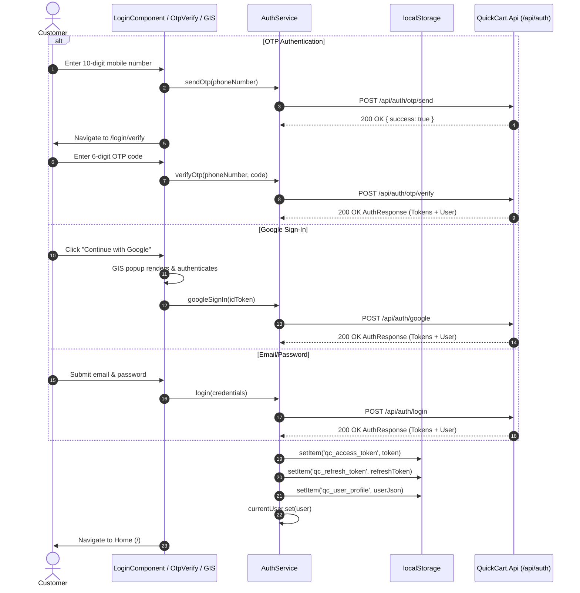

# Diagram: Multi-Channel Customer Authentication Flow

This diagram models the sequence of actions across Mobile OTP, Google Identity Services, and Email/Password sign-in flows.

```mermaid
sequenceDiagram
    autonumber
    actor Customer as Customer
    participant UI as LoginComponent / OtpVerify / GIS
    participant Auth as AuthService
    participant Storage as localStorage
    participant API as QuickCart.Api (/api/auth)

    alt OTP Authentication
        Customer->>UI: Enter 10-digit mobile number
        UI->>Auth: sendOtp(phoneNumber)
        Auth->>API: POST /api/auth/otp/send
        API-->>Auth: 200 OK { success: true }
        UI->>Customer: Navigate to /login/verify
        Customer->>UI: Enter 6-digit OTP code
        UI->>Auth: verifyOtp(phoneNumber, code)
        Auth->>API: POST /api/auth/otp/verify
        API-->>Auth: 200 OK AuthResponse (Tokens + User)
    else Google Sign-In
        Customer->>UI: Click "Continue with Google"
        UI->>UI: GIS popup renders & authenticates
        UI->>Auth: googleSignIn(idToken)
        Auth->>API: POST /api/auth/google
        API-->>Auth: 200 OK AuthResponse (Tokens + User)
    else Email/Password
        Customer->>UI: Submit email & password
        UI->>Auth: login(credentials)
        Auth->>API: POST /api/auth/login
        API-->>Auth: 200 OK AuthResponse (Tokens + User)
    end

    Auth->>Storage: setItem('qc_access_token', token)
    Auth->>Storage: setItem('qc_refresh_token', refreshToken)
    Auth->>Storage: setItem('qc_user_profile', userJson)
    Auth->>Auth: currentUser.set(user)
    UI->>Customer: Navigate to Home (/)
```
