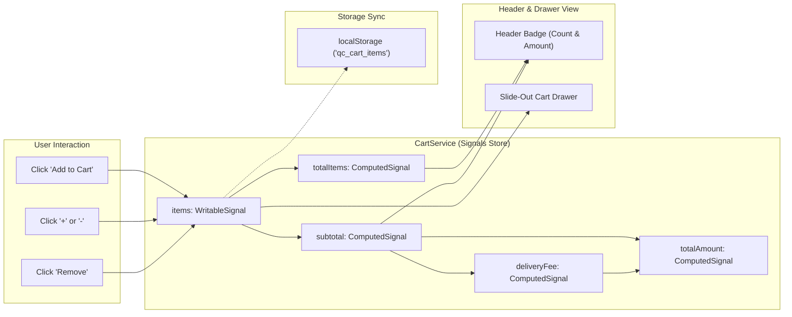

# Diagram: Signal-Driven Reactive Cart Engine

This diagram models user interactions, Signals transformations, and storage synchronization within `CartService`.

```mermaid
flowchart LR
    subgraph UI_Actions["User Interaction"]
        AddBtn["Click 'Add to Cart'"]
        QtyBtn["Click '+' or '-'"]
        RemoveBtn["Click 'Remove'"]
    end

    subgraph CartStore["CartService (Signals Store)"]
        items["items: WritableSignal<CartItem[]>"]
        subtotal["subtotal: ComputedSignal"]
        deliveryFee["deliveryFee: ComputedSignal"]
        totalAmount["totalAmount: ComputedSignal"]
        totalItems["totalItems: ComputedSignal"]
    end

    subgraph Sync["Storage Sync"]
        LocalStorage["localStorage ('qc_cart_items')"]
    end

    subgraph HeaderView["Header & Drawer View"]
        Badge["Header Badge (Count & Amount)"]
        Drawer["Slide-Out Cart Drawer"]
    end

    AddBtn --> items
    QtyBtn --> items
    RemoveBtn --> items

    items --> subtotal
    items --> totalItems
    subtotal --> deliveryFee
    subtotal --> totalAmount
    deliveryFee --> totalAmount

    items -.-> LocalStorage
    totalItems --> Badge
    subtotal --> Badge
    items --> Drawer
```
