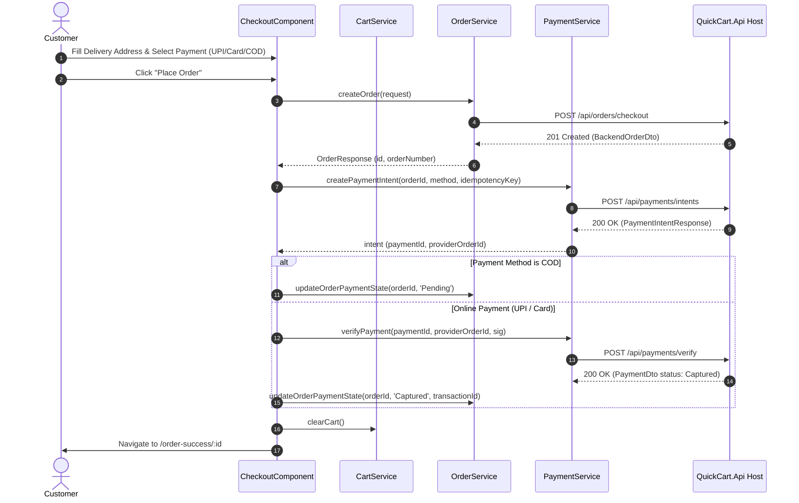

# Diagram: Checkout & Payment Settlement Flow

This diagram models the order placement, payment intent creation, signature verification, and local order storage flow.

```mermaid
sequenceDiagram
    autonumber
    actor Customer as Customer
    participant Checkout as CheckoutComponent
    participant Cart as CartService
    participant Orders as OrderService
    participant Payments as PaymentService
    participant API as QuickCart.Api Host

    Customer->>Checkout: Fill Delivery Address & Select Payment (UPI/Card/COD)
    Customer->>Checkout: Click "Place Order"
    Checkout->>Orders: createOrder(request)
    Orders->>API: POST /api/orders/checkout
    API-->>Orders: 201 Created (BackendOrderDto)
    Orders-->>Checkout: OrderResponse (id, orderNumber)

    Checkout->>Payments: createPaymentIntent(orderId, method, idempotencyKey)
    Payments->>API: POST /api/payments/intents
    API-->>Payments: 200 OK (PaymentIntentResponse)
    Payments-->>Checkout: intent (paymentId, providerOrderId)

    alt Payment Method is COD
        Checkout->>Orders: updateOrderPaymentState(orderId, 'Pending')
    else Online Payment (UPI / Card)
        Checkout->>Payments: verifyPayment(paymentId, providerOrderId, sig)
        Payments->>API: POST /api/payments/verify
        API-->>Payments: 200 OK (PaymentDto status: Captured)
        Checkout->>Orders: updateOrderPaymentState(orderId, 'Captured', transactionId)
    end

    Checkout->>Cart: clearCart()
    Checkout->>Customer: Navigate to /order-success/:id
```
