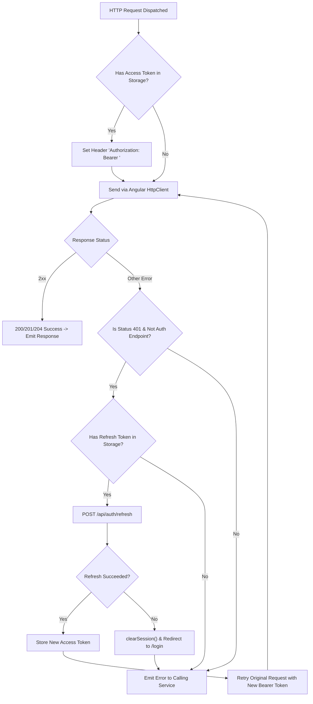

# Diagram: HTTP Interceptor & Token Refresh Flow

This diagram models the outbound HTTP request pipeline, Authorization header injection, and 401 error retry loop in `authInterceptor`.

```mermaid
flowchart TD
    Req["HTTP Request Dispatched"]
    CheckToken{"Has Access Token in Storage?"}
    AddBearer["Set Header 'Authorization: Bearer <token>'"]
    Send["Send via Angular HttpClient"]
    
    ResponseCheck{"Response Status"}
    Success["200/201/204 Success -> Emit Response"]
    Err401{"Is Status 401 & Not Auth Endpoint?"}
    PassErr["Emit Error to Calling Service"]
    
    CheckRefresh{"Has Refresh Token in Storage?"}
    Refresh["POST /api/auth/refresh"]
    RefreshResult{"Refresh Succeeded?"}
    SaveNew["Store New Access Token"]
    Retry["Retry Original Request with New Bearer Token"]
    Purge["clearSession() & Redirect to /login"]

    Req --> CheckToken
    CheckToken -- Yes --> AddBearer --> Send
    CheckToken -- No --> Send
    
    Send --> ResponseCheck
    ResponseCheck -- 2xx --> Success
    ResponseCheck -- Other Error --> Err401
    
    Err401 -- Yes --> CheckRefresh
    Err401 -- No --> PassErr
    
    CheckRefresh -- Yes --> Refresh
    CheckRefresh -- No --> PassErr
    
    Refresh --> RefreshResult
    RefreshResult -- Yes --> SaveNew --> Retry --> Send
    RefreshResult -- No --> Purge --> PassErr
```
